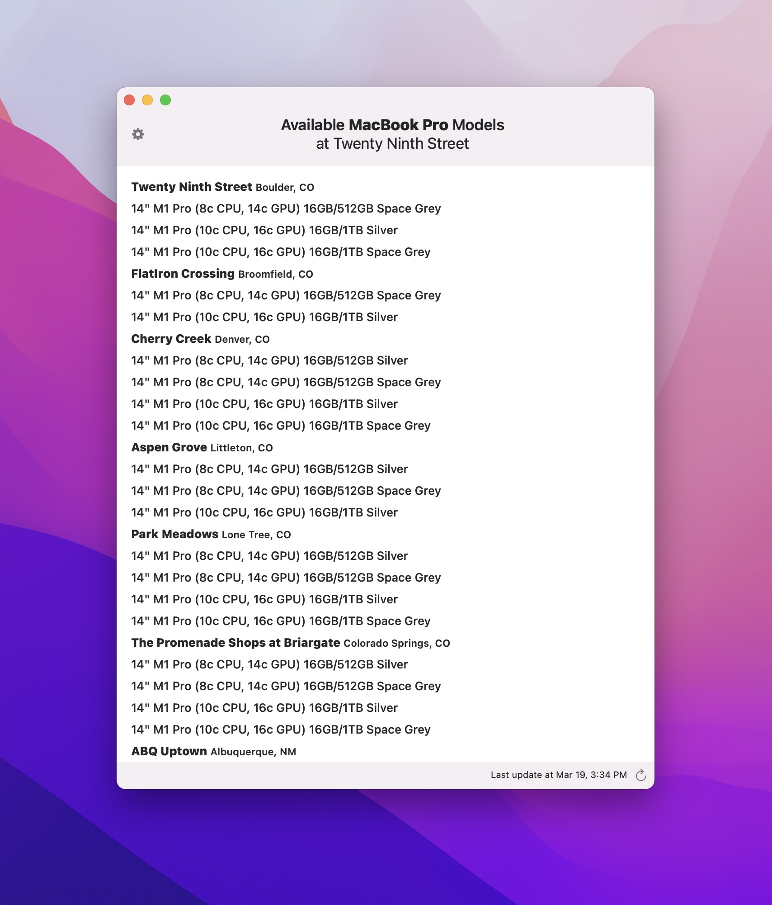

## [Download InventoryWatch (0.0.5) Now ⤵️](./InventoryWatch-0.0.5.zip)

### What is InventoryWatch?

InventoryWatch is an app for macOS that monitors local Apple Store inventory and notifies you when your preferred model comes in-stock. 

### Why do I need that? 

Ordering a new Apple product online can often involve monthslong shipping times and frustratingly vague delivery estimates. InventoryWatch is designed to help you jump the line: Apple Stores frequently (but irregularly) get fresh stock of hard-to-find products. When that happens, InventoryWatch will notify you immediately, so you can place an in-store pickup order and get your product in *minutes* instead of months. 

### What products does InventoryWatch support? 

InventoryWatch can monitor local stock for the following products: 

* M2 MacBook Air (**new**)
* MacBook Pro (14" and 16")
* M2 MacBook Pro 13" (**new**)
* Mac Studio
* Studio Display
* iPhone 13
* iPhone 13 mini
* iPhone 13 Pro
* iPhone 13 Pro Max
* iPad mini (wifi and cellular)

Note that not all build-to-order configurations will be stocked by Apple Stores (this is especially true for MacBook Pros). InventoryWatch only lists configurations that are known to be stocked by Apple Stores. 

_Don't see your product on the list? Add an issue to the Github project [here](https://github.com/worthbak/inventory-checker-app/issues)._

### Does InventoryWatch support my local store? 

InventoryWatch supports querying in-store pickup stock in seven countries:

  * United States
  * Canada
  * United Kingdom
  * Australia
  * Germany
  * South Korea
  * Hong Kong

_Don't see your country on the list? Add an issue to the Github project [here](https://github.com/worthbak/inventory-checker-app/issues)._

### How much does all of this cost? 

InventoryWatch is free, and does not collect any identifiable information about you. Anonymized usage statistics are collected.

### System requirements? 

macOS Big Sur 11.5 or newer. InventoryWatch is built with SwiftUI. 

---

## Ready to go?

[Download InventoryWatch (0.0.5) Now ⤵️](./InventoryWatch-0.0.5.zip)
