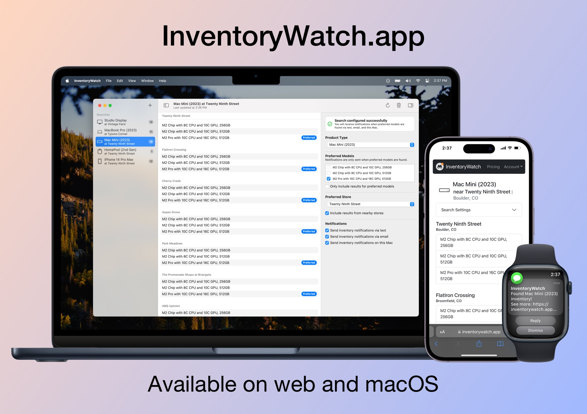

# InventoryWatch 2.0 is here!

[Download today! ➡️](https://inventorywatch.app)

## What's New in 2.0

InventoryWatch 2.0 is a massive upgrade, adding many of our most-requested features:

* A completely rewritten and redesigned macOS app, with the ability to add multiple searches 
* Support for email and text notifications - no need to stay glued to your Mac!
* A brand-new web app, bringing InventoryWatch to any platform with a browser (including your iPhone)
* Search for Apple's latest products, including the M2 Mac Studio and 15in MacBook Air
* Server-side product updates - no need to update the app whenever new products are launched

One thing remains the same: **our committment to privacy, and generally not being creepy**. InventoryWatch doesn't track you, has no ads or invasive analytics packages, and will only send you emails that you've asked for.

## How To Upgrade

As always, InventoryWatch for macOS is available to download for free. You can get it now at our new homepage: [InventoryWatch.app](https://inventorywatch.app)

Support for premium features like email and text notifications, multiple searches, and web access are available via an InventoryWatch subscription, starting at just $2 per month. You can learn more and check out pricing here: [InventoryWatch Pricing](https://inventorywatch.app/plans)

Got feedback, or found a bug? Open an issue at our new feedback repo: [InventoryWatch Feedback on Github](https://github.com/Rugged-Apps/InventoryWatch-Feedback)

Finally, if you have questions or just want to send us a message, we're on mastodon.social [@InventoryWatch](https://mastodon.social/@InventoryWatch), and [Twitter](https://twitter.com/InventoryWatch) as well (if you're into that kinda thing).

We're incredibly excited for you to try InventoryWatch 2.0, and would love to hear what you think!

Learn more: [InventoryWatch.app](https://inventorywatch.app)
